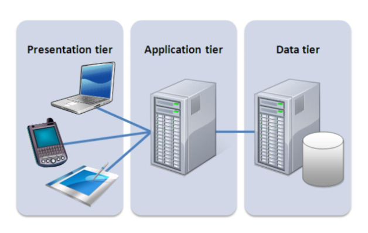

# Web Solution with WordPress


---


In this project, I set up a full web solution using WordPress on two Linux servers in AWS. One server runs the WordPress website and another runs the MySQL database  and I configured the storage on both servers from scratch using disk partitioning and LVM (Logical Volume Manager).

`For large enterprise environments, I would choose Red Hat Enterprise Linux because it provides strong security policies, long-term stability, and dedicated enterprise-level support but in this project i chose good old UBUNTU`


### Why does this matter in real life?

Your browser just sent a request. Somewhere, a server caught it, handed it to a database, and fired back a response all before you finished blinking. That split-second chain of events is what I spent my time building from scratch. Two servers, one purpose: don't break.

---

## Three-Tier Architecture

This project follows the **Three-Tier Architecture** pattern, which splits a web application into three layers:

1. **Presentation Layer** — The browser or client that the user interacts with
2. **Business Layer** — The web server running WordPress and Apache
3. **Data Layer** — The database server running MySQL



My setup used:
- A laptop as the client
- An EC2 Linux server as the **Web Server** (WordPress lives here)
- An EC2 Linux server as the **Database Server** (MySQL lives here)

---

## Step 1: Prepare the Web Server

### Launch the EC2 Instance and Attach Volumes

I launched a EC2 instance to serve as my web server, then created **3 volumes of 10 GiB each** in the same availability zone and attached them to the instance.


### Inspect the Attached Disks

I used `lsblk` to confirm the three new block devices were visible (they showed up as `xvdf`, `xvdg`, and `xvdh`):

```bash
lsblk
ls /dev/
```


I also checked the current disk usage and available space:

```bash
df -h
```


### Partition the Disks

I created a single partition on each of the 3 disks using `fdisk`:

```bash
sudo fdisk /dev/xvdf
sudo fdisk /dev/xvdg
sudo fdisk /dev/xvdh
```


I ran `lsblk` again to confirm the partitions were created.

### Set Up LVM

Then I marked each partition as a **Physical Volume (PV)** so LVM could use them:

```bash
sudo pvcreate /dev/xvdf1
sudo pvcreate /dev/xvdg1
sudo pvcreate /dev/xvdh1
```


I grouped all 3 physical volumes into a single **Volume Group (VG)** called `webdata-vg`:

```bash
sudo vgcreate webdata-vg /dev/xvdf1 /dev/xvdg1 /dev/xvdh1
sudo vgs
```


I then split the volume group into two **Logical Volumes (LVs)**:
- `apps-lv` — to store website files
- `logs-lv` — to store log data

```bash
sudo lvcreate -n apps-lv -L 14G webdata-vg
sudo lvcreate -n logs-lv -L 14G webdata-vg
sudo lvs
```


I verified the full setup looked correct:

```bash
sudo vgdisplay -v
sudo lsblk
```


### Format and Mount the Logical Volumes

I formatted both logical volumes with the `ext4` filesystem:

```bash
sudo mkfs -t ext4 /dev/webdata-vg/apps-lv
sudo mkfs -t ext4 /dev/webdata-vg/logs-lv
```


Then I created the directories and mounted everything:

```bash

sudo mkdir -p /var/www/html
sudo mkdir -p /home/recovery/logs


sudo mount /dev/webdata-vg/apps-lv /var/www/html/


sudo rsync -av /var/log/. /home/recovery/logs/
```


```bash
# Mount the logs volume
sudo mount /dev/webdata-vg/logs-lv /var/log

# Restore the log files
sudo rsync -av /home/recovery/logs/. /var/log
```


### Make the Mounts Permanent

Without this step, the mounts would disappear after a server restart. I used the device UUIDs to update `/etc/fstab`:

```bash
sudo blkid
```


```bash
sudo nano /etc/fstab
```


Then I tested the config and reloaded the system daemon:

```bash
sudo mount -a
sudo systemctl daemon-reload
```


I ran `df -h` one more time to confirm everything was mounted correctly:


---

## Step 2: Prepare the Database Server

I launched a second EC2 instance for the database server and repeated all the same disk setup steps from Step 1. The only differences were:

- I created `db-lv` instead of `apps-lv`
- I mounted it to `/db` instead of `/var/www/html`

---

## Step 3: Install WordPress on the Web Server

I updated the server and installed Apache, PHP, and all the tools WordPress needs:

```bash
sudo apt update && sudo apt upgrade -y
sudo apt install -y wget apache2 php php-mysqlnd php-fpm php-json
```


I started and enabled Apache so it runs automatically on reboot:

```bash
sudo systemctl start apache2
sudo systemctl enable apache2
```


Then I installed the PHP extensions WordPress requires:

```bash
sudo apt install php8.3 php8.3-fpm php8.3-opcache php8.3-gd php8.3-curl php8.3-mysql
```


I downloaded WordPress, extracted it, and copied it into the web directory:

```bash
mkdir wordpress && cd wordpress
sudo wget http://wordpress.org/latest.tar.gz
sudo tar xzvf latest.tar.gz
sudo rm -rf latest.tar.gz
sudo cp wordpress/wp-config-sample.php wordpress/wp-config.php
sudo cp -R wordpress /var/www/html/
```


Then I set the correct file ownership and permissions so Apache could read and serve the WordPress files:

```bash
sudo chown -R www-data:www-data /var/www/html/wordpress
sudo chmod -R 755 /var/www/html/wordpress
sudo systemctl restart apache2
```


---

## Step 4: Install MySQL on the Database Server

On the DB server, I installed MySQL:

```bash
sudo apt update
sudo apt install mysql-server
sudo systemctl restart mysqld
sudo systemctl enable mysqld
```


---

## Step 5: Configure the Database for WordPress

I created a dedicated database and user for WordPress, and only allowed connections from the web server's private IP:

```sql
sudo mysql

CREATE DATABASE wordpress;
CREATE USER 'myuser'@'<Web-Server-Private-IP-Address>' IDENTIFIED BY 'mypass';
GRANT ALL ON wordpress.* TO 'myuser'@'<Web-Server-Private-IP-Address>';
FLUSH PRIVILEGES;
SHOW DATABASES;
exit
```


---

## Step 6: Connect WordPress to the Database

### Open MySQL Port on the DB Server

I added an inbound rule on the DB server's security group to allow TCP port 3306 — but only from the web server's IP address (`/32`) for security.


### Update the MySQL Config

On the DB server, I edited the MySQL config file to allow the web server to connect:

```bash
sudo nano /etc/my.cnf
sudo systemctl restart mysqld
```


### Update the WordPress Config

On the web server, I edited the WordPress config file with the database details:

```bash
cd /var/www/html/wordpress
sudo nano wp-config.php
```


### Remove the Default Apache Page

I moved the default Apache welcome page out of the way so WordPress could be seen instead:

```bash
sudo mv /etc/httpd/conf.d/welcome.conf /etc/httpd/conf.d/welcome.conf_backup
sudo systemctl restart apache2
```


### Test the Database Connection

I tested the remote connection from the web server to the database server:

```bash
sudo mysql -u admin -p -h <DB-Server-Private-IP-address>
```


### Access WordPress in the Browser

I opened a browser and went to:

```
http://<Web-Server-Public-IP-Address>/wordpress/
```


I filled in my credentials to finish setting up the site. Seeing this screen confirmed that WordPress had successfully connected to the remote MySQL database.


---

## What I Learned

This project taught me a lot more than just "how to install WordPress." I learned how to:

- Set up and partition raw disk storage on a Linux server from scratch
- Use LVM to manage storage flexibly grouping physical disks into logical volumes that are easier to resize and manage
- Separate a web application across multiple servers the way real production systems are built
- Secure database access by restricting connections to specific IP addresses
- Configure Apache and PHP to serve a WordPress site on Linux
